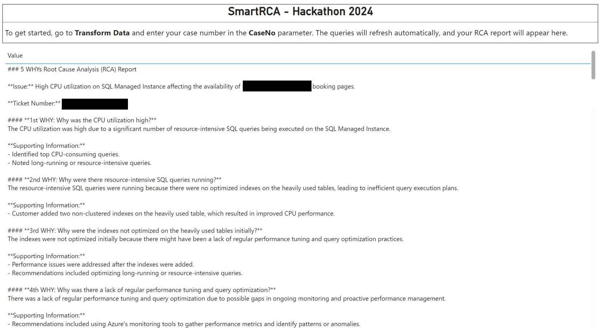

# MicrosoftHackathon2024-SmartRCA

SmartRCA is a tool leveraging Azure OpenAI services to automate the generation of 5 WHYs Root Cause Analysis (RCA), based on ticket details such as case metadata, case notes and communication emails.

Please note that all confidential information has been masked in the code to ensure security and compliance. 

Example of an RCA output:

### 5 WHYs Root Cause Analysis (RCA) Report

#### **Issue Description:**
- **Problem:** High CPU usage on SQL Managed Instance since 9:25 UTC on 9/9, leading to partial unavailability of booking pages.
- **Impact:** Significant business impact affecting customer booking processes.

### Analysis Using the 5 WHYs Methodology

#### **1st WHY:**
**Why was there high CPU usage on the SQL Managed Instance?**
- **Answer:** High CPU usage was identified due to specific queries consuming a large amount of CPU resources.

#### **2nd WHY:**
**Why were these queries consuming a large amount of CPU resources?**
- **Answer:** The queries were inefficiently designed, leading to suboptimal execution plans that caused excessive CPU load.

#### **3rd WHY:**
**Why were the execution plans suboptimal?**
- **Answer:** The suboptimal execution plans were due to missing indexes on heavily used tables, causing full table scans and inefficient joins.

#### **4th WHY:**
**Why were the necessary indexes missing on the heavily used tables?**
- **Answer:** The indexes were not initially identified as necessary, possibly due to a lack of regular performance monitoring and query optimization practices.

#### **5th WHY:**
**Why was there a lack of regular performance monitoring and query optimization?**
- **Answer:** There might have been insufficient emphasis on proactive database performance management and tuning, leading to reactive rather than preventative measures.

### Root Cause:
The high CPU usage on the SQL Managed Instance was primarily caused by inefficient query designs and missing indexes on heavily used tables. This issue was compounded by a lack of regular performance monitoring and optimization practices.

### Corrective Actions Implemented:
1. **Identified High CPU Queries:** Utilized Azure SQL Database Query Performance Insight and SSMS to identify high CPU-consuming queries and top waiting queries.
2. **Optimized Queries and Added Indexes:** Added two non-clustered indexes to the heavily used table, which significantly improved CPU performance.
3. **Cleared Redis Cache and Restarted Applications:** Cleared the Redis Cache and restarted applications to refresh cache usage.
4. **Engaged AKS Team:** Engaged the AKS team to verify potential issues on the AKS side and ensure no other underlying issues were contributing to the problem.
5. **Ongoing Monitoring:** Implemented continuous monitoring to track CPU usage and ensure the issue does not recur.

### Preventative Measures:
1. **Regular Performance Monitoring:** Establish regular monitoring and performance reviews of SQL queries and execution plans to proactively identify and address potential issues.
2. **Query Optimization Best Practices:** Adopt and enforce best practices for query optimization, including regular index maintenance and query rewrites.
3. **Database Maintenance:** Perform regular database maintenance tasks, such as updating statistics and rebuilding indexes, to ensure optimal performance.
4. **Utilize Performance Recommendations:** Leverage Azure SQL Managed Instance’s built-in performance recommendations for automatic tuning suggestions.

### Follow-up Actions:
1. **Confirm Resolution:** Await customer confirmation that the high CPU usage issue has been fully resolved and no further issues are observed.
2. **Close Ticket:** If no further issues are reported, proceed to close the ticket.
3. **Documentation:** Document the incident and the steps taken for future reference and to improve incident response processes.

### Summary:
The high CPU usage issue on customer's SQL Managed Instance was caused by inefficient queries and missing indexes. The problem was mitigated by adding the necessary indexes, clearing cache, and restarting applications. Preventative measures and ongoing monitoring have been put in place to ensure long-term stability and performance.

By following these steps and maintaining close communication with the customer, we can ensure that similar issues are avoided in the future and the SQL Managed Instance operates efficiently.

